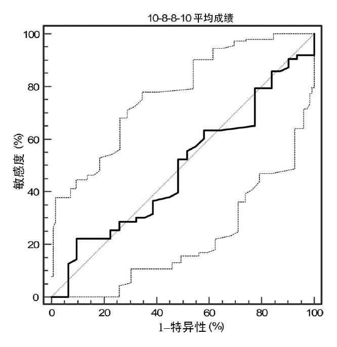
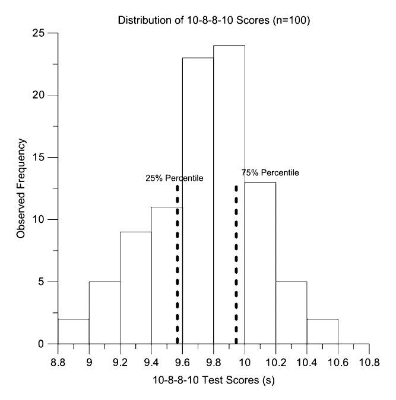

# 研究结果

ARA-B 组的裁判员年龄显著大于 ARLP 组（p < 0.0001；95 CI% -4.10 – -2.10；ES = 1.25）。在测试前的 6 周准备阶段，ARA-B 组和 ARLP 组在耐力、冲刺与灵活性以及反复冲刺能力方面的训练时间比没有显著差异。两组分别将 68 ± 5.1% 和 67 ± 6.8%（p = 0.34，95% CI -0.78–1.78；ES = 0.17）的时间用于耐力训练，将 15 ± 4.6% 和 14 ± 5.8%（p = 0.22，95% CI -0.81–1.81；ES = 0.19）的时间用于冲刺与灵活性训练，将 10 ± 4.3% 和 9 ± 6.8%（p = 0.44，95% CI -0.6–1.6；ES = 0.18）的时间用于反复冲刺能力训练。ARLP 组用于柔韧性训练的时间占比（9 ± 1.8%）显著高于ARA-B 组（7 ± 1.8%）（p = 0.04，95% CI 1.3–2.7，ES = 0.32）。

ARA-B 组和 ARLP 组的平均最佳成绩分别为 9.61 ± 0.45 秒和 9.66 ± 0.41 秒（p = 0.57；95% CI -0.13–0.23；ES = 0.11；n = 100）。两组裁判员所有测试的平均成绩分别为 9.81 ± 0.41 秒和 9.78 ± 0.41 秒（p = 0.72；95% CI -0.21–0.14；ES = 0.07；n = 100）。

综合两组裁判员所有测试的平均成绩，平均值为 9.74 ± 0.34 秒（95% CI 9.67–9.81），中位数为 9.79（95% CI 9.67–9.84），众数为 9.64 秒。相应地，两组裁判员最佳成绩的平均值为 9.60 ± 0.36 秒（95% CI 9.52–9.67），中位数为 9.63（95% CI 9.54–9.70），众数为 9.48 秒。

受试者工作特征分析显示，在该助理裁判员群体中，10-8-8-10 测试对于检测裁判员的竞技水平差异并不敏感，曲线下面积为 0.49（p = 0.87；95% CI 0.38–0.60；如图 1 所示）。

> <figure align="center">
>    
> </figure>
> <strong>图 1.</strong> 10-8-8-10 测试结果的受试者工作特征（ROC）图
>
> 假设裁判员的竞技水平为二分变量，即 Serie A-B vs. Lega Pro，各 50 人；曲线下面积（AUC）= 0.49，p = 0.87；95% CI 0.38–0.60；黑色实线为受试者工作特征曲线。

10-8-8-10 测试的组内相关系数为 0.90（n = 64，p < 0.0001，95% CI 0.84–0.93）。第一次与第二次测试间的典型测量误差（TEM）为 0.21 秒（95% CI 0.18–0.24），第二次与第三次测试间的 TEM 为 0.18 秒（95% CI 0.16–0.21）。基于所有裁判员（n = 100）的平均成绩或最佳成绩进行计算，测试的最小有意义变化（SWC）均为 0.07 秒。

测试成绩的 25% 百分位数为 9.57 秒（95% CI 9.39–9.64），75% 百分位数为 9.94 秒（95% CI 9.85–10.09）（如图 2 所示）。

> <figure align="center">
>    
> </figure>
> <strong>图 2.</strong> 10-8-8-10 测试成绩分布图（垂直黑色虚线分别代表 25% 百分位数和 75% 百分位数）
